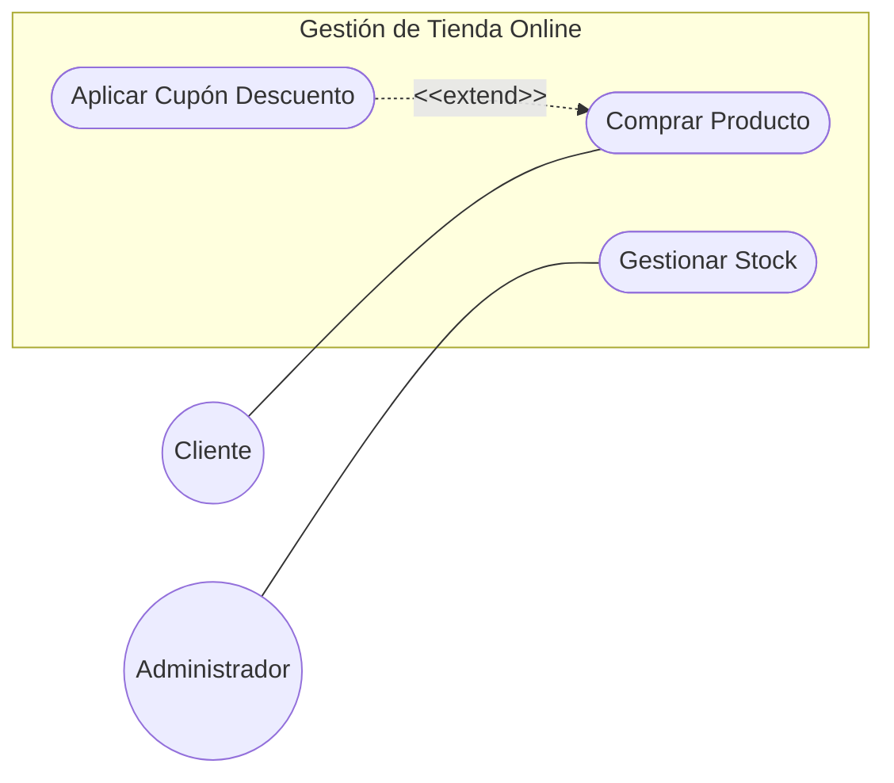

# Entornos-7.2 - CASOS DE USO

## Ej 1: El Sistema de Iluminación Inteligente
**Contexto:** Queremos modelar una aplicación móvil sencilla para controlar las luces de una casa.

* **Actores:** Un **Usuario**.
* **Funcionalidades:** El usuario debe poder "Encender luces" y "Apagar luces".
* **Reto:** Representar la interacción básica actor-sistema.

---

## Ej 2: Gestión de Tienda Online
**Contexto:** Un sistema de comercio electrónico donde interactúan diferentes perfiles.

* **Actores: Cliente** y **Administrador**.
* **Funcionalidades:**
   * El **Cliente** puede "Comprar Producto".
   * El **Administrador** puede "Gestionar Stock".
* **Relaciones Especiales:** Al "Comprar Producto", el sistema permite de forma opcional "Aplicar Cupón Descuento" (si el cliente tiene uno).
* **Reto:** Aplicar correctamente la relación de extensión (<<extend>>).

---

