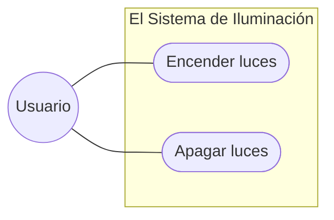

# Entornos-7.2 - CASOS DE USO

## Ej 1: El Sistema de Iluminación Inteligente
**Contexto:** Queremos modelar una aplicación móvil sencilla para controlar las luces de una casa.

* **Actores:** Un **Usuario**.
* **Funcionalidades:** El usuario debe poder "Encender luces" y "Apagar luces".
* **Reto:** Representar la interacción básica actor-sistema.

---

